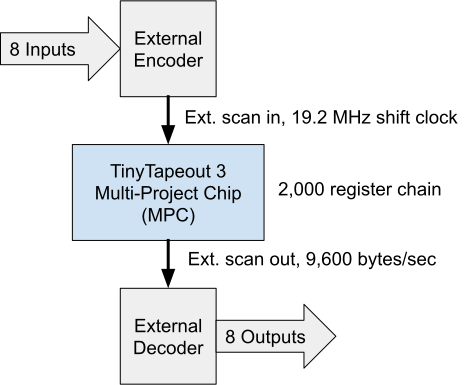
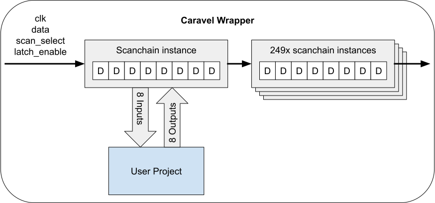
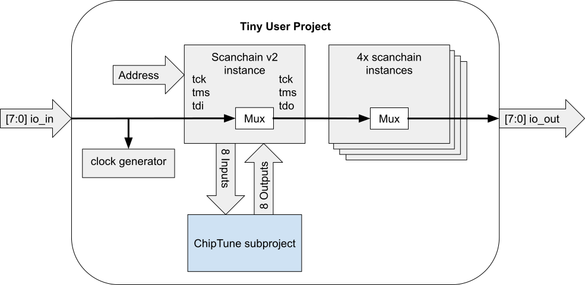
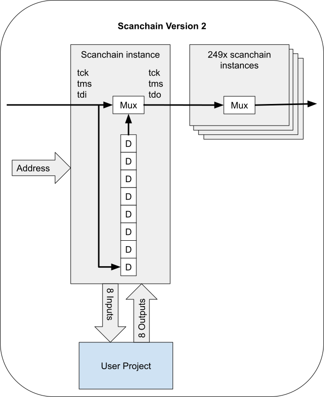
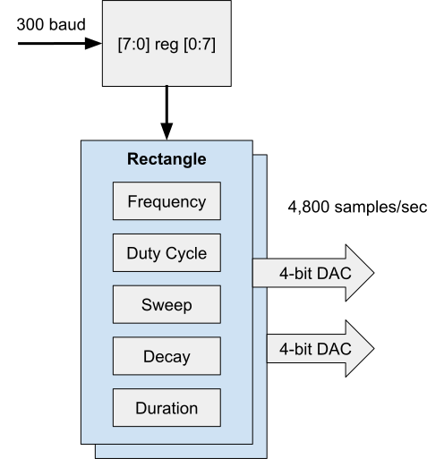
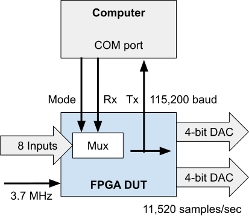

 

# The ChipTune Project

This is a two-in-one project. First, an audio device replicates the square-wave sound generators of vintage video games. Second, a re-imagined version of the scan controller is implemented to demonstrate faster data acquisition.

## TinyTapeout 3 Configuration

For this third Multi Project Chip (MPC) tapeout, the original scan chain will be configures in 'external mode'. The inputs and outputs for user projects will be derived externally from the scanchain data, not the I/O pins. The scanchain control signals will occupy the device pins designated io_in and io_out. Expected throughput is better than 10k byte/second. The ChipTune project will configure the shift clock to attain 9600 bytes/sec.

Devices from the eFabless Multi-Project Wafer (MPW) shuttle are delivered in two package options, each with 64 pins. TinyTapeout 2 will be packaged in a QFN, whereas TinyTapout 3 will be packaged as a WCSP. In both delivered configurations, the device is mounted to a daughter board PCB with 10 castellated pins per side.

The daughter board provides basic clock, configuration and power management for the Caravel SoC.

### Pin Assignments
| Signal      | Name                          | Dir | WCSP | QFN | PCB   |
| ----------- | ----------------------------- |---- |----- |---- |------ |
| mprj_io[0]  | JTAG                          | In  | D7   | 31  | J3.14 |
| mprj_io[1]  | SDO                           | Out | E9   | 32  | J3.13 |
| mprj_io[2]  | SDI                           | In  | F9   | 33  | J3.12 |
| mprj_io[3]  | CSB                           | In  | E8   | 34  | J3.11 |
| mprj_io[4]  | SCK                           | In  | F8   | 35  | J3.10 |
| mprj_io[5]  | SER_RX                        | In  | E7   | 36  | J3.9  |
| mprj_io[6]  | SER_TX                        | Out | F7   | 37  | J3.8  |
| mprj_io[7]  | IRQ                           | In  | E5   | 41  | J3.7  |
| mprj_io[8]  | DRIVER_SEL[0]                 | In  | F5   | 42  | J3.6  |
| mprj_io[9]  | DRIVER_SEL[1]                 | In  | E4   | 43  | J3.5  |
| mprj_io[10] | SLOW_CLK                      | Out | F4   | 44  | J3.4  |
| mprj_io[11] | SET_CLK_DIV                   | In  | E3   | 45  | J3.3  |
| mprj_io[12] | ACTIVE_SELECT[0]              | In  | F3   | 46  | J3.2  |
| mprj_io[13] | ACTIVE_SELECT[1]              | In  | D3   | 48  | J3.1  |
| mprj_io[14] | ACTIVE_SELECT[2]              | In  | E2   | 50  | J2.14 |
| mprj_io[15] | ACTIVE_SELECT[3]              | In  | F1   | 51  | J2.13 |
| mprj_io[16] | ACTIVE_SELECT[4]              | In  | E1   | 53  | J2.12 |
| mprj_io[17] | ACTIVE_SELECT[5]              | In  | D2   | 54  | J2.11 |
| mprj_io[18] | ACTIVE_SELECT[6]              | In  | D1   | 55  | J2.10 |
| mprj_io[19] | ACTIVE_SELECT[7]              | In  | C10  | 57  | J2.9  |
| mprj_io[20] | ACTIVE_SELECT[8]              | In  | C2   | 58  | J2.8  |
| mprj_io[21] | IO_IN[0] / EXT_SCAN_CLK_OUT   | In  | B1   | 59  | J2.7  |
| mprj_io[22] | IO_IN[1] / EXT_SCAN_DATA_OUT  | In  | B2   | 60  | J2.6  |
| mprj_io[23] | IO_IN[2] / EXT_SCAN_SELECT    | In  | A1   | 61  | J2.5  |
| mprj_io[24] | IO_IN[3] / EXT_SCAN_LATCH_EN  | In  | C3   | 62  | J2.4  |
| mprj_io[25] | IO_IN[4]                      | In  | A3   |  2  | J2.3  |
| mprj_io[26] | IO_IN[5]                      | In  | B4   |  3  | J2.2  |
| mprj_io[27] | IO_IN[6]                      | In  | A4   |  4  | J2.1  |
| mprj_io[28] | IO_IN[7]                      | In  | B5   |  5  | J1.14 |
| mprj_io[29] | IO_OUT[0] / EXT_SCAN_DATA_IN  | Out | A5   |  6  | J1.13 |
| mprj_io[30] | IO_OUT[1] / EXT_SCAN_DATA_IN  | Out | B6   |  7  | J1.12 |
| mprj_io[31] | IO_OUT[2]                     | Out | A6   |  8  | J1.11 |
| mprj_io[32] | IO_OUT[3]                     | Out | A7   | 11  | J1.10 |
| mprj_io[33] | IO_OUT[4]                     | Out | C8   | 12  | J1.9  |
| mprj_io[34] | IO_OUT[5]                     | Out | B8   | 13  | J1.4  |
| mprj_io[35] | IO_OUT[6]                     | Out | A8   | 14  | J1.3  |
| mprj_io[36] | IO_OUT[7]                     | Out | B9   | 15  | J1.2  |
| mprj_io[37] | READY                         | Out | A9   | 16  | J1.1  |

## Caravel Connections

Within the Caravel SoC, the TinyTapeout project has configured the user space into 250 sub-projects. Each project is interconnected by a scanchain that serpentines through the chip. Control of the 4-wire chain provides access to each project.

The scanchain topology has pros and cons, as would any interconnect scheme. This project presents an alternative topology based on a JTAG implementation. The advantage is a reduction in the length of the register latency.

Scanchain V1
- Pro: Economical use of resources. Readily hardened in ASIC fabric. Testable on FPGA platform.
- Con: Very long register chain (2,000) impacts overall acquisition rate.

Scanchain V2
- Pro: Short register chain (10) minimizes latency. Economical use of resources. Testable on FPGA platform.
- Con: Speed limited by length of multiplexer propagation (250 instances).

Multiplexer
- Pro: Pure combinatorial output. Potential to be fastest option.
- Con: Requires large number of long routing resources. Not testable on FPGA platform.

## Project Configuration

This project embeds another scanchain (version 2) to demonstrate its low latency and testability. The penalty for this implementation is 10 clock cycles per transfer. The delay is mitigated by a serial UART expanding the internal registers of the audio generator. Four extra scanchain endpoints are included for demonstration purposes.

A clock generator is used to recover the clock from asynchronous serial data. An external 16x baud clock is required by the design. The planned 4800 Hz project clock will permit a 300 baud serial link.

## Scanchain Version 2

The re-imagined scanchain uses a bypass technique commonly seen with JTAG devices. Each tap in the chain routes data through a combinatorial multiplexer until it is activated. Individual taps are assigned a unique 8-bit address during tapeout elaboration. A tap is activated when receiving a matching address message, enabling its' 8-bit shift registers.

Encoding of serial data is compatible with the ubiquitous UART format. The waveform is one-start, eight-data, one-stop. Least significant bits are transmitted fist. An immediate advantage is the use of a computer COM port to generate and analyze functional data. The serial interface is in addition to decoded parallel data available on the I/O ports.

## ChipTune Operation

The audio portion of the project consists of two rectangular pulse generators. Each module is controlled by four 8-bit registers. Configurable parameters are the frequency, duty cycle, sweep, decay, and note duration.

The frequency range of the project is limited by the legacy scanchain, but mid-range frequencies are acceptable. Additional triangle and noise modules will be added in future work when more bandwidth is available.

## Design For Test Considerations

Version 2 of the scanchain has been tested on an FPGA platform with good results. A shift rate of 3.7 MHz enables communication with the computer at 115,200 baud. Longer scan chains do not affect throughput until the multiplexer delays become dominant.

Output of the sub-project is always available at both the parallel output port and the serial data. A 'Mode' signal driven by the DTS line controls whether the project's input is derived from the parallel input port or serial data.

## Summary

The next shuttle for TinyTapeout is planning a multiplexer for selecting between the 250 projects. This will alleviate latency in the present design.

The revised scanchain offered here is an alternative for other group projects. The scanchain topology still holds merit in many applications.
